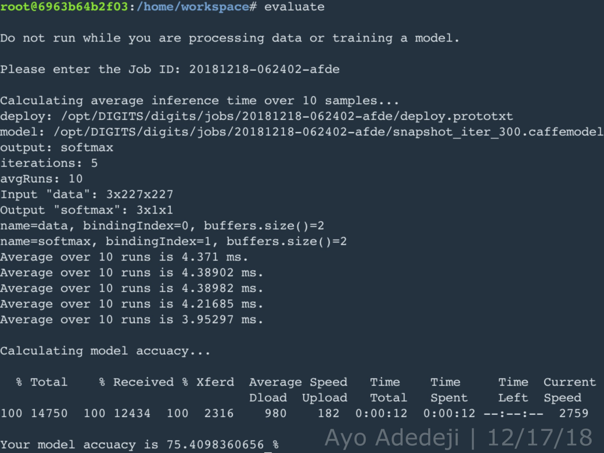
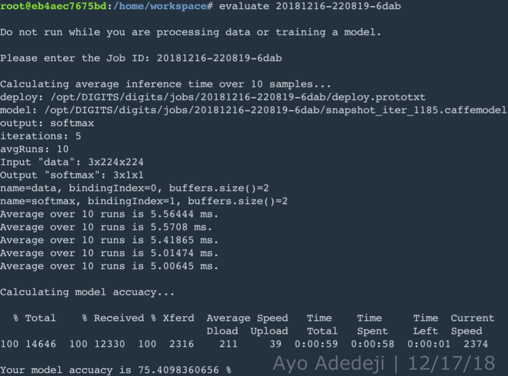
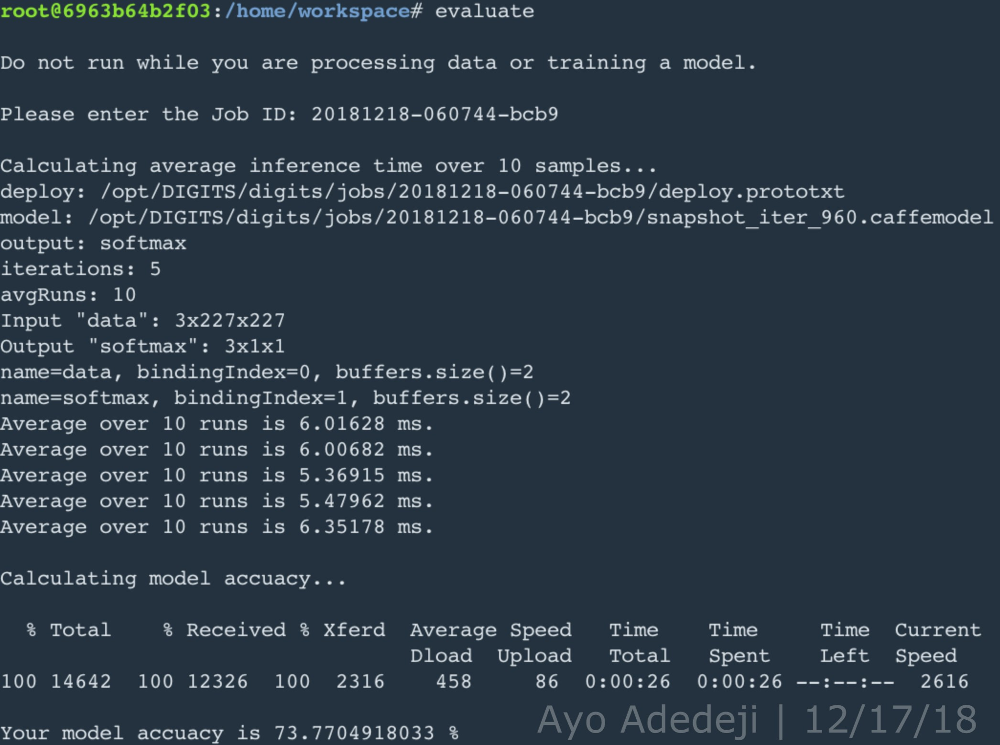
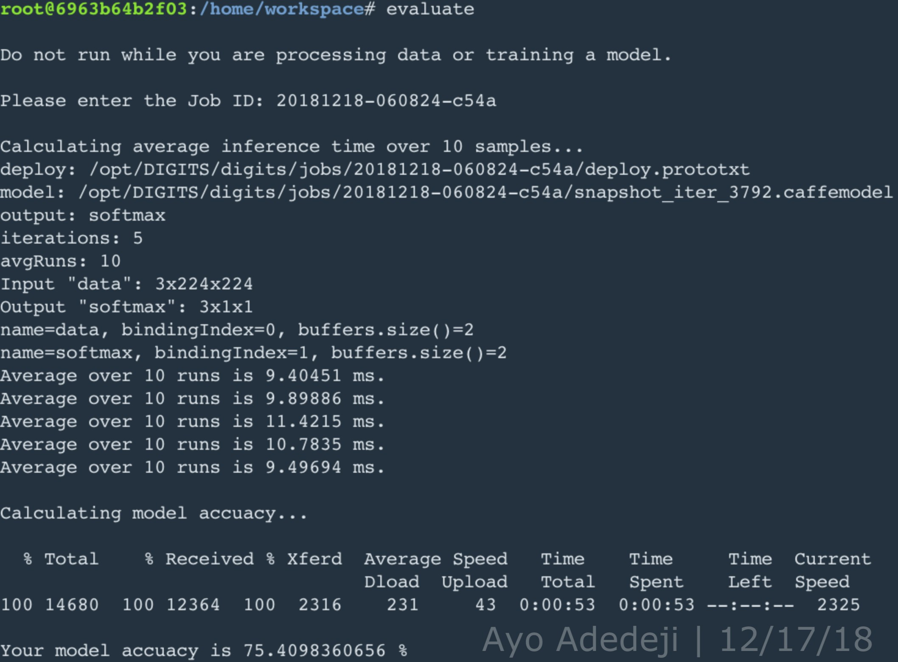
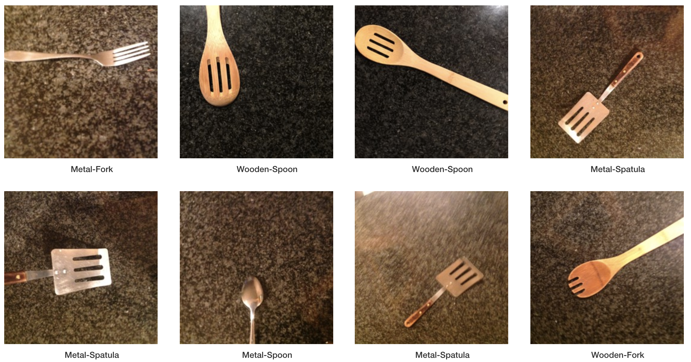
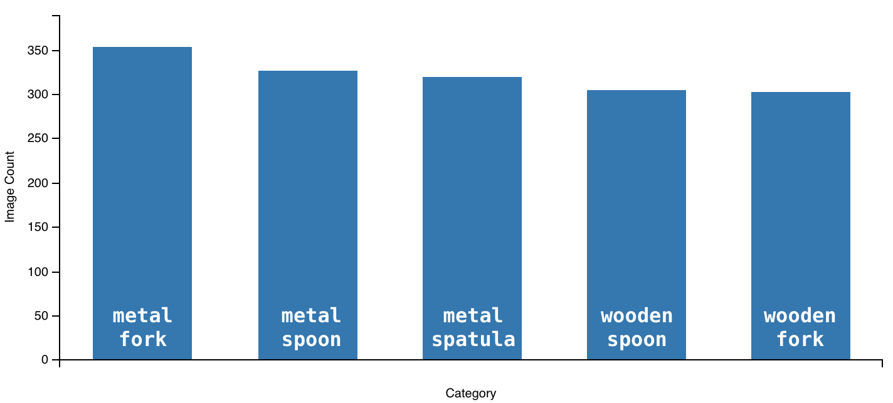
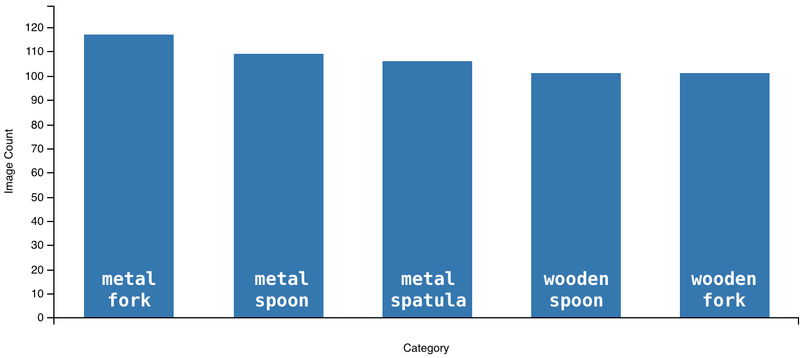
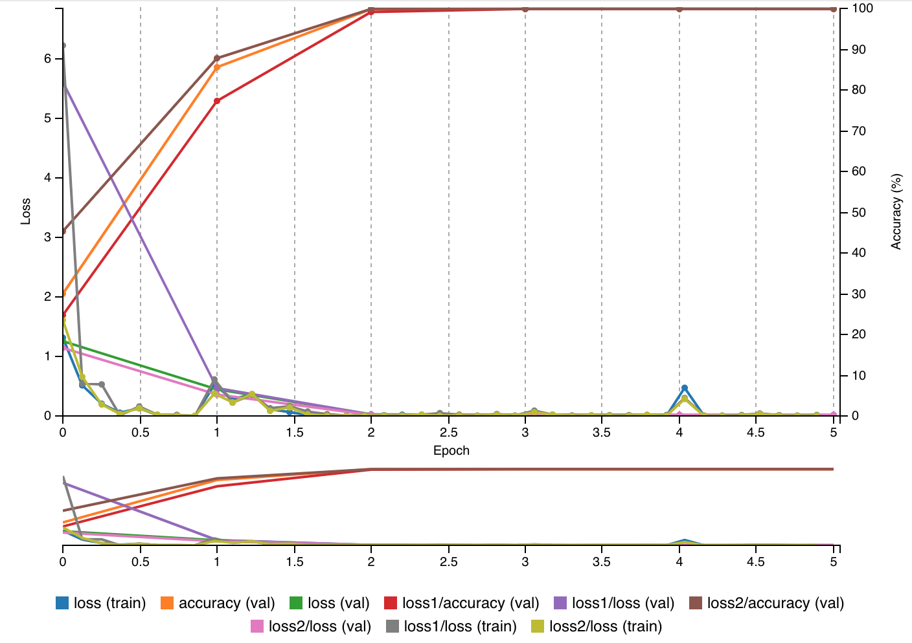
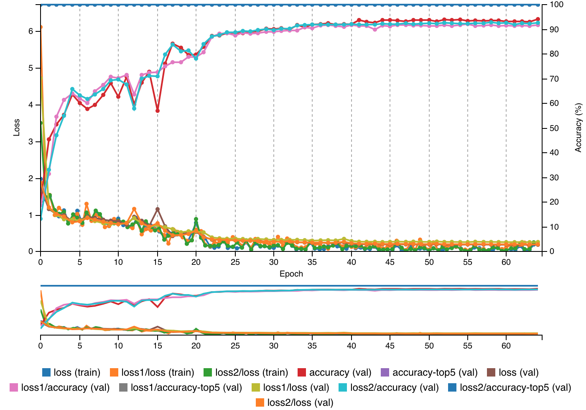
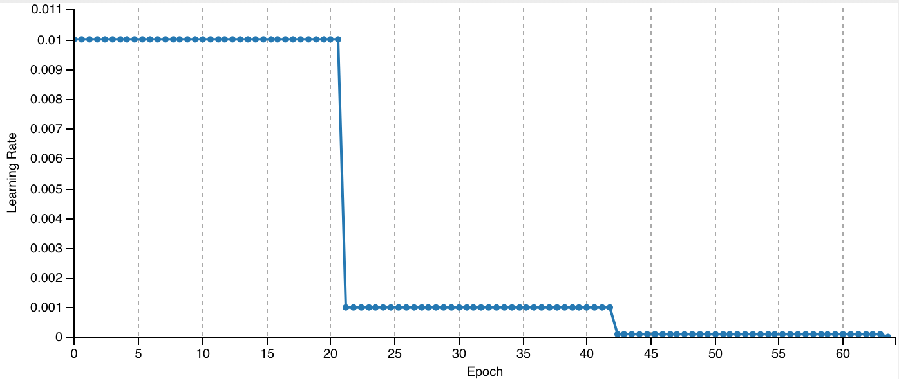

[](https://www.udacity.com/robotics)

## Robotic Inference Project
### Writeup by Ayo Adedeji
---
## [Rubric](https://review.udacity.com/#!/rubrics/1319/view) Points
---
### Abstract
In this project, five convolutional neural network (CNN) prototypes were rapidly trained and tested using the NVIDIA Deep Learning GPU Training System (DIGITS) for image classification. The first four CNN prototypes in this project —  AlexNet(5 epoches;SGD), GoogLeNet(5 epoches;SGD), AlexNet(16 epoches;SGD), and GoogLeNet(16 epoches; SGD) with a base α of .001 — were trained and validated using 10,094 supplied images of a bottle, candy wrapper, and empty space; the supplied dataset was split such that 75% (7570) of the dataset was used for training, and the other 25% (2524) of the dataset was used for validation. The numerical objective of these first CNN prototypes was to achieve an inference time below 10ms and an accuracy above 75%: this was achieved by both AlexNet(5 epoches;SGD) and GoogLeNet(5 epoches;SGD), with equivalent accuracy and AlexNet faring better with regards to inferencing time by an average of ~1ms. The second objective of the project was to generete a CNN network prototype trained and validated on self-collected data. Given the distortions expected to arise in the dataset ipso facto the nature of self-collected data, and particularly that of silverware and utensils which can distort light, it was anticipated beforehand that way more than 5 epoches would be necessary to achieve an adequate accuracy pertaining to classification of the self-collected data. Comparision of AlexNet(16 epoches;SGD) and GoogLeNet(16 epoches; SGD) performance on the supplied dataset was used to aid intuition on which model would produce better accuracy with additional iterations, epoches, through the training set. GoogLeNet performed better than AlexNet, which regards to accuracy, with more epoches, and maximal accuracy is considered to be more important than optimized inferencing speed for the nature of the robotic inference idea tested in this project: the classification of silverware and utensils to facilitate elderly cooking. A CNN prototype, GoogLeNet (64 epoches; SGD), was generated for this purpose and demonstrated an accuracy of classification of utensils and silverware upwards of ~90%.

#### Introduction
An oft-stated problem in robotics is the recognition of objects from a live video camera feed. Deep learning models and their optimization algorithms are similarly often employed as solutions to this problem. Further, in their capacity as solutions to this problem, DL models through their ability to facilitate object classification have had great impact and will have continued impact on multiple realms of society and industry ranging from mail sorting to cooking in assisted living homes. On the topic of assisted living homes, object classification was attempted in this project using DIGITS for rapid training and tesing of two CNNs, AlexNet and GoogLeNet, for image classification of a supplied image dataset and a self-collected image dataset of utensils and silverware. Image classification of utensils and silverware was investigated with the idea in mind that such object classification could facilitate the process of cooking for elderly who either enjoy cooking or perhaps have to cook for themselves because they live by themselves or in assisted living homes: elderly people generally begin to lose their eyesight as they age and lose the ability to differentiate between smaller lines and shapes at arms length distance.

#### Background / Formulation
DIGITS is preseeded with three CNNs for image classificaiton: LeNet, AlexNet, GoogLeNet. Only AlexNet and GoogleNet were used in this project because LeNet is optimized for object classification in the context a training and validation datasets of 28 x 28 grayscale images: a condition that did not apply to either supplied or self-collected image datasets of this project. To achieve the numerical objective of an inference time below 10ms and an accuracy above 75%, a hyperparameter value of 5 epoches and the learning algorithm choice of stochastic gradient descent (SGD) was settled on, guided by intuition and experimental trial and error (e.g to achieve an accuracy of 75% more than one epoch it was anticipated that certainly more than one epoch would be needed but more than 8 or so would be overkill and begin to extend inferencing time beyond the acceptable limit.)

<p align="center">
    
    
</p>

Given that it was anticipated that more than 5 epoches would be necessary for high accuracy on the self-collected dataset, also coupled with the fact the CNN prototypes, AlexNet and GoogLeNet, used on the supplied dataset had the same accuracy at 5 epoches, the number of epoches was bumped up to 16 while keeping all other hyperparameters the same. At 16 epoches, the accuracy of the AlexNet prototype went down, perhaps due to overfitting on the training set, while the accuracy of GoogLeNet prototype stayed the same. It is necessary to note that the while the accuracy of the GoogLeNet prototype was found to be better, its inferencing speed was consistently slower than that of the AlexNet prototype. However, accuracy is considered to be more important in the tradeoff between accuracy and inferencing speed for this project. Likewise, GoogleNet was chosen as the CNN for this project (coupled with SGD and a epoch value of 64 to give the CNN prototype enough time to learn generalized features of the training dataset but, at the same time, minimize overfitting).

<p align="center">
    
    
</p>

#### Data Acquisition
All images for the self-collected dataset were taken manually using an iPhone 6 Plus and iPad 3. In the self-collected dataset of 2138 total images, there are five category of utensils and silverware: metal spoon (435 images), metal fork (470 images), metal spatula (425 images), wooden spoon (405 images), and wooden fork (403 images). All utensils and silverware were placed on a granite tabletop in a kitchen area, to best approximate the intended environment of real time classification, and the iPhone 6 Plus or iPad 3 was manually rotated over each utensil category at a arm's length distance. Measures were taken to maximize the variety of angles and positions of images taken for each utensil, so that during training the final CNN prototype would learn to generalize classification to broader, generalized features of each utensil. Additionally, maximizing the variety of angles and positions of images taken for each utensil helped approximate the conditions a utensil might present itself in a kitchen: utensils are not always in any one particular position. Regarding the breakdown of the self-collected dataset for training and validation, 75% of the self-collected dataset was used for training; the other 25% was used for validation.

<p align="center">
    
    
    
</p>

All photos taken using an iPhone 6 Plus and iPad 3 were originally 2448×2448 pixels; however, since GoogLeNet is functionalized for 256x256 images and DIGITS has a method of resizing images (but without retaining original aspect ratio), a python script was used to resize all images to 256x256 pixels (whilst maintaining original aspect ratio) before the utensil dataset was uploaded to DIGITS. 

```python
def resize_all_images_in_dir(class_name, files_in_dir_list, final_size):
    """
    Resize all images in specified dir
    Args:
        class_name (str)
        files_in_dir_list (list)
        final_size (int)
    """
    for file_name_index, file_name in enumerate(files_in_dir_list):
         print('\n{} file_name: {}'.format(file_name_index, file_name))
         if file_name == '.DS_Store':
             continue
         print('PATH_NAME/class_name/file_name: {}/{}/{}'.format(PATH_NAME, class_name, file_name))
         if os.path.isfile('{}/{}/{}'.format(PATH_NAME, class_name, file_name)):
             im = Image.open('{}/{}/{}'.format(PATH_NAME, class_name, file_name))
             f, e = os.path.splitext('{}/{}/{}'.format(PATH_NAME, class_name, file_name))
             size = im.size
             print('original image size: {}'.format(size))
             ratio = float(final_size) / max(size)
             new_image_size = tuple([int(x*ratio) for x in size])
             im = im.resize(new_image_size, Image.ANTIALIAS)
             new_im = Image.new("RGB", (final_size, final_size))
             new_im.paste(im, ((final_size-new_image_size[0])//2, (final_size-new_image_size[1])//2))
             new_im.save('{}_img_{}_resized.jpg'.format(class_name.lower(), file_name_index), 'JPEG', quality=90)
```
#### Results
The accuracy of the GoogLeNet prototype (5 epoches; SGD) trained on the supplied dataset was approximately 100% (as shown below). And as aforementioned and shown above, when evaluating the GoogleNet prototype, the accuracy and average inferencing time for the GoogLeNet prototype was 75.40983% and 5.34 ms respectively: meeting the numerical requirements of 75% and <1 0ms for a CNN model trained on the supplied dataset in this project.
<p align="center">
    
</p>
The validation accuracy of the GoogLeNet prototype (64 epoches; SGD) trained on the entire utensil/silvereware dataset was approximately 95%. The accuracy for any given utensil category ranged between 92% and 100%. The training and validation losses never diverged and, at the 64th epoch, were comparable at a value of around .5. By the 42nd epoch, the learning rate of the GoogLeNet prototype model dropped to zero, and correspondingly, there were no appreciable gains in validation accuracy beyond this epoch.
<p align="center">
    
    
</p>
#### Discussion
Given training loss and validation loss are comparable at the 64th epoch, in other words the train loss to validation loss ratio is around 1 at the 64th epoch, it can be posited that the GoogLeNet model did not overfit or "memorize" the training dataset, which would have manifested in an observable deterioration in performance regarding the validation dataset. Additionally, given that the GoogLeNet model was able to achieve an overall validation accuracy of approximately 95%, it can be posited that the model succesfully learned generalized features of each utensil category. Its ability to learn generalized features was aided by the variety of images in each category taken at different angles and positions; similarly, its ability to learn generalized features was also inhibited by the fact that all images in the utensil dataset were taken in the same environment with minimal object interference and/or presence of other objects in the plane of view. As image classification of utensils and silverware was investigated with the idea in mind that such object classification could facilitate the process of cooking for elderly, by all appearances, the GoogLeNet model trained on the utensil dataset would be useful to an extent in helping the elderly identify given utensils and silverware in the kitchen or simply complement individual intuition. It is particularly encouraging that although elderly people generally lose the ability to differentiate between smaller lines at an arms length distance, the GoogLeNet has shown the ability to classify images of different utensils with similar lines and images of utensils that are subject to light distortion. 

#### Conclusions / Future Work
* The GoogLeNet model of this project is not yet a commercially viable product; although, it is one the right track. Classification functionality would first have to be made more robust by training the model on a dataset with a wider variety of utensils and silverware and with thousands of more images.
* Given that silverware has a tendency to distort light in images, it is very likely that a certain percentage of any given utensil dataset will have functionally compromised images. In that case, it would be best to tune the batch size hyperparameter (i.e instead of performing SGD, perform mini-batch gradient descent) such that internal parameters are only modified through backpropagation or inception, in the case of GoogLeNet, when a robust selection of images have been processed. Due to time constraints, there was not enough time to optimally tune the batch size hyperparameter in this project and SGD, the default in DIGITS was utilized.
* For Data Acquisition, photos were manually taken at a variety of angles and positions. This was likewise a very time-consuming process. Nevertheless, a quick search online for relevant techniques to speed up the process revealed that there are [data augmentation](https://github.com/mdbloice/Augmentor) techniques that can be employed to generate a large number of functionally robust images (i.e rotated images, distorted images) from a smaller, more easily obtained number of images. In a future work, data augmentation would be utilized to speed up the process of generating a large dataset and potentially improve end validation accuracy of the GoogLeNet model.
